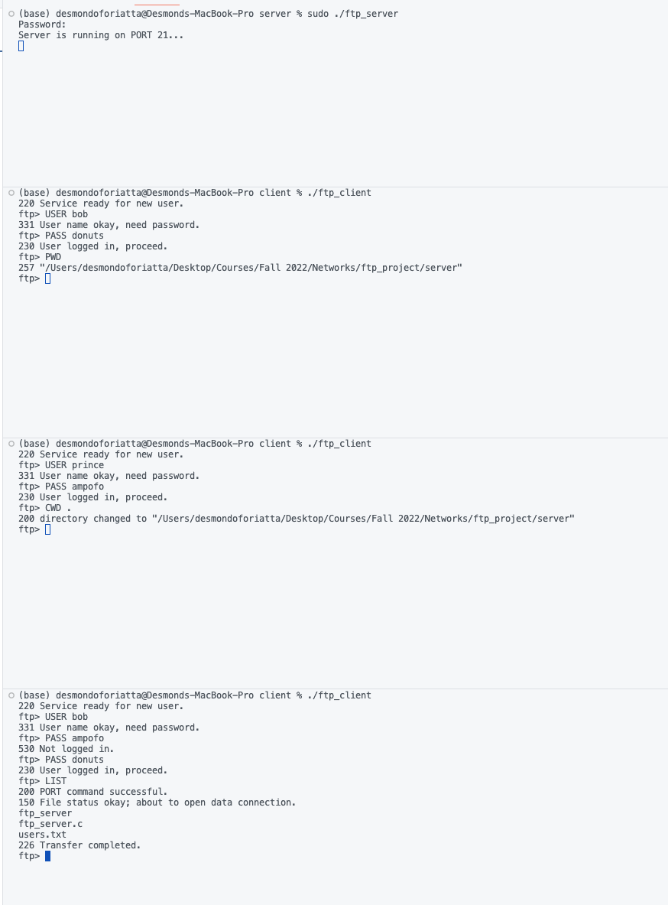
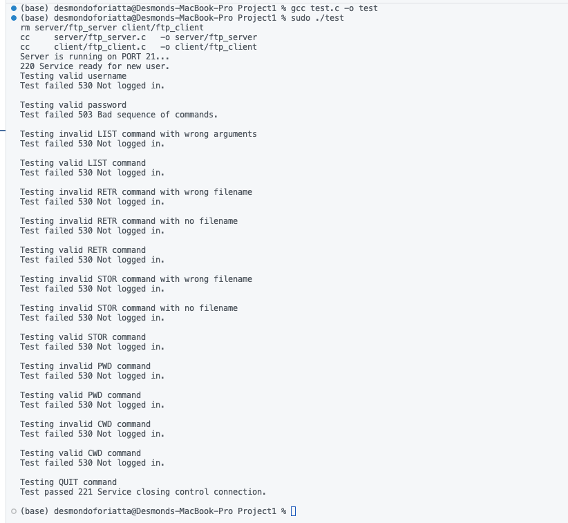

# Computer Networks Project 1 - *FTP Server And Client*

## Project Description
This is a simplified **FTP** written in C for the transfer of file between two hosts using TCP. Since this is a simplified version of the protocol we implemented only 
   - [X] USER and PASS: Login functionality
   - [X] LIST : List the files in the current working directly
   - [X] STOR : Send a file from client to server
   - [X] RETR : Request and receive a file from the server
   - [X] PWD  : Get the working directory 
   - [X] CWD  : Change the working directory 
   - [X] QUIT : Quit the program

## How to run
- Run make in your terminal
- Run the ftp_server in your terminal. Since it uses port 20 and 21, run it in privileged mode.
- Run ftp_client to spin up clients
## TEST CASES
Below is an image of the working program. 

## Test code
- Find test code in the directory. To be able to get it to work, you will need to change the names of the example files and the paths.
- Also, you need to run the execute file in privileged mode. 
- We tested for all the features of the ftp program and they all returned expected results.

## Collaborators
- Prince Ampofo Larbi
- Desmond Ofori Atta